# 1. System Requirements Document

**Project:** ESP32 UART Stopwatch  
**Author:** Adrian Sanchez Garcia
**Version:** 1.0
**Date:** [04-08-2025]  

---

## 1.1. Introduction

This document describes the system-level requirements for the ESP32 UART Timer project. It serves as the foundation for software development and future validation, and it will be extended to include requirement traceability.

---

## 1.2. Glossary

| Term        | Description                           |
|-------------|---------------------------------------|
| UART        | Universal Asynchronous Receiver/Transmitter |
| EEPROM      | Electrically Erasable Programmable Read-Only Memory |
| OLED        | Organic Light-Emitting Diode display  |

---

## 1.3. System Requirements

---

### 1.3.1. Connectivity

#### 1.3.1.1. REQ-SYS-CON-001 — UART Command Reception  
The system shall receive ASCII commands via UART.

#### 1.3.1.2. REQ-SYS-CON-002 — I2C Communication with OLED  
The system shall communicate with the OLED display using I2C.

#### 1.3.1.3. REQ-SYS-CON-003 — I2C Communication with EEPROM  
The system shall communicate with the EEPROM over I2C.

---

### 1.3.2. Behavior

#### 1.3.2.1. REQ-SYS-BEH-001 — Start Stopwatch  
The system shall allow the user to start the stopwatch via the UART `START` command.

#### 1.3.2.2. REQ-SYS-BEH-002 — Pause Stopwatch  
The system shall pause timing upon receiving the `PAUSE` command.

#### 1.3.2.3. REQ-SYS-BEH-003 — Reset Stopwatch  
The system shall reset the stopwatch and clear stored time upon `RESET`.

#### 1.3.2.4. REQ-SYS-BEH-004 — Return Elapsed Time  
The system shall return the elapsed time in response to the `STATUS` command.

---

### 1.3.3. Display

#### 1.3.3.1. REQ-SYS-DSP-001 — Show Time on OLED  
The system shall continuously update and display the current time on the OLED screen.

#### 1.3.3.2. REQ-SYS-DSP-002 — Show Status (optional)  
The system may display additional status messages on the OLED (e.g., Paused, Running).

---

### 1.3.4. Storage

#### 1.3.4.1. REQ-SYS-STO-001 — Store Elapsed Time  
The system shall store the elapsed time in EEPROM when paused.

#### 1.3.4.2. REQ-SYS-STO-002 — Restore Time on Boot  
The system shall restore the previously stored time from EEPROM at startup.

---

### 1.3.5.  Power and Environment

#### 1.3.5.1. REQ-SYS-PWR-001 — Operate at 3.3V  
The system shall operate with a 3.3V power supply.

---

## 1.4. Assumptions and Constraints

- UART is available and connected to a terminal emulator (e.g., `minicom`, `PuTTY`).
- EEPROM is accessible via I2C and has enough capacity to store a 32-bit timestamp.
- OLED screen is available via I2C and supports 128x64 resolution.
- System does not require real-time clock (RTC); timing is based on system uptime.

## 1.5. System architecture

```mermaid
graph TD
    User["🧑 User via UART Terminal"]
    ESP32["🧠 ESP32 (Main Controller)"]

    subgraph Interfaces
        UART["📡 UART Interface"]
        I2C["🔗 I2C Bus"]
    end

    subgraph Peripherals
        OLED["📺 OLED Display (SSD1306)"]
        EEPROM["💾 EEPROM (AT24C256)"]
        Analyzer["🔍 Logic Analyzer (for debugging)"]
    end

    User -->|Commands| UART -->|Serial Data| ESP32
    ESP32 -->|Text Output| UART

    ESP32 -->|Display Update| I2C --> OLED
    ESP32 -->|Read/Write Logs| I2C --> EEPROM

    ESP32 -->|Debug Signals| Analyzer

```

