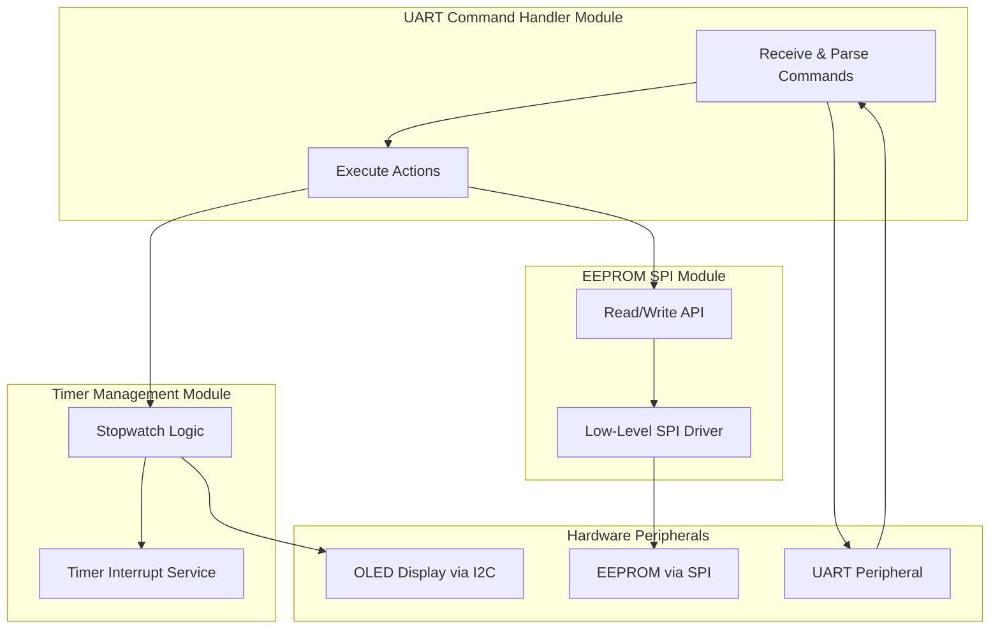
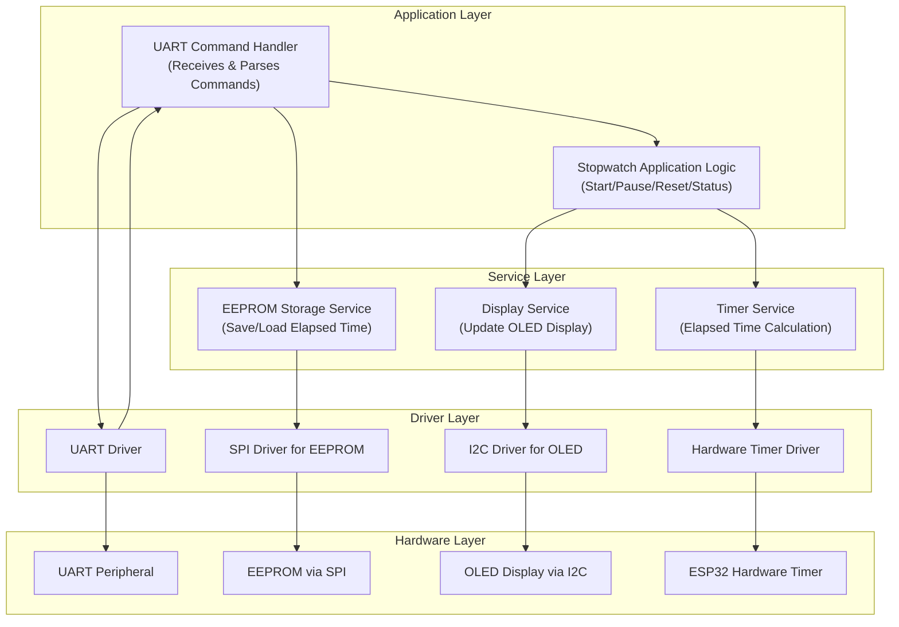

# 2. Software Architecture Document

**Project:** ESP32 UART Stopwatch  
**Author:** Adrian Sanchez Garcia  
**Version:** 1.0  
**Date:** [09-08-2025]  

---

## 2.1. Introduction

This document defines the software architecture for the ESP32 UART Stopwatch project.  
It specifies the software modules, their responsibilities, and their interfaces, and links each software requirement to its corresponding system requirement for traceability.

---

## 2.2. Glossary

| Term        | Description                           |
|-------------|---------------------------------------|
| SPI         | Serial Peripheral Interface           |
| UART        | Universal Asynchronous Receiver/Transmitter |
| I2C         | Inter-Integrated Circuit              |
| EEPROM      | Electrically Erasable Programmable Read-Only Memory |
| API         | Application Programming Interface     |

---

## 2.3. Software Requirements

---

### 2.3.1. Communication Modules

#### 2.3.1.1. REQ-SW-COM-001 — UART Command Handler  
**Description:** The software shall process incoming UART ASCII commands (`START`, `PAUSE`, `RESET`, `STATUS`) and trigger appropriate actions.  
**Traceability:** Linked to REQ-SYS-CON-001, REQ-SYS-BEH-001, REQ-SYS-BEH-002, REQ-SYS-BEH-003, REQ-SYS-BEH-004.

#### 2.3.1.2. REQ-SW-COM-002 — EEPROM SPI Driver  
**Description:** The software shall provide an SPI-based EEPROM driver to store and retrieve elapsed time data.  
**Traceability:** Linked to REQ-SYS-STO-001, REQ-SYS-STO-002.  
**Note:** System requirement mentions I2C, but this module will implement SPI as per design decision.

---

### 2.3.2. Timer Module

#### 2.3.2.1. REQ-SW-TIM-001 — Stopwatch Core  
**Description:** The software shall implement start, pause, reset, and elapsed time retrieval using hardware timers.  
**Traceability:** Linked to REQ-SYS-BEH-001, REQ-SYS-BEH-002, REQ-SYS-BEH-003, REQ-SYS-BEH-004.

#### 2.3.2.2. REQ-SW-TIM-002 — Periodic Display Update  
**Description:** The software shall periodically trigger display refreshes with the current stopwatch time.  
**Traceability:** Linked to REQ-SYS-DSP-001, REQ-SYS-DSP-002.

---

## 2.4. Software Architecture Overview

---

## 2.5. Module Descriptions

| Module Name                 | Responsibilities | Interfaces |
|-----------------------------|------------------|------------|
| **UART Command Handler**    | Receive UART input, parse commands, invoke timer or storage operations. | UART Driver API, Timer Module API, EEPROM API |
| **EEPROM SPI Module**       | Store/retrieve elapsed time to/from EEPROM. | SPI Driver API, EEPROM hardware |
| **Timer Management Module** | Maintain stopwatch logic, handle timing events, refresh display. | Hardware Timer API, OLED Display API |

---

## 2.6. Traceability Matrix

| System Requirement ID  | Software Requirement(s) |
|------------------------|--------------------------|
| REQ-SYS-CON-001        | REQ-SW-COM-001           |
| REQ-SYS-CON-002        | REQ-SW-TIM-002           |
| REQ-SYS-CON-003        | REQ-SW-COM-002           |
| REQ-SYS-BEH-001        | REQ-SW-COM-001, REQ-SW-TIM-001 |
| REQ-SYS-BEH-002        | REQ-SW-COM-001, REQ-SW-TIM-001 |
| REQ-SYS-BEH-003        | REQ-SW-COM-001, REQ-SW-TIM-001 |
| REQ-SYS-BEH-004        | REQ-SW-COM-001, REQ-SW-TIM-001 |
| REQ-SYS-DSP-001        | REQ-SW-TIM-002           |
| REQ-SYS-DSP-002        | REQ-SW-TIM-002           |
| REQ-SYS-STO-001        | REQ-SW-COM-002           |
| REQ-SYS-STO-002        | REQ-SW-COM-002           |

---

## 2.7. Assumptions and Constraints

- The software will use FreeRTOS tasks for module separation.
- The SPI bus is dedicated to EEPROM.
- Timer operations rely on ESP32 hardware timers.
- All inter-module communication is through clearly defined APIs.

## 2.8 Software Architecture

