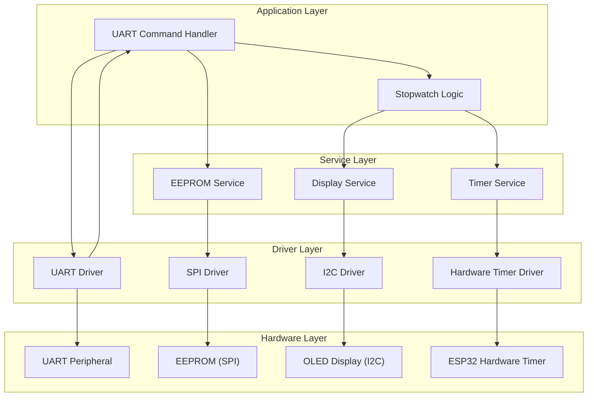

# Software Architecture Document (SWAD)

**Project:** ESP32 UART Stopwatch  
**Author:** Adrian Sanchez Garcia  
**Version:** 1.0  
**Date:** 10-08-2025  

---

## 1. Introduction

### 1.1 Purpose
This document describes the software architecture of the ESP32 UART Stopwatch project.  
It details the software components, their responsibilities, and the interfaces between them.  
It also maps software requirements (from the SRS) to the architecture for traceability.

### 1.2 Scope
The architecture covers:
- Command handling via UART
- Stopwatch logic
- Persistent storage in EEPROM
- Display update service

---

## 2. References

| Document | Version | Link |
|----------|---------|------|
| System Requirements Specification (SyRS) | 1.0 | [0_SyRS.md](0_SyRS.md) |
| Software Requirements Specification (SRS) | 1.0 | [1_SRS.md](1_SRS.md) |
| ESP32 Technical Reference Manual | — | [ESP32](../00_Doc/esp32-wroom-32_datasheet_en.pdf) |

---

## 3. Software Architecture Overview

### 3.1 Architectural Layers
The software is organized into four layers:
1. **Application Layer** — Implements stopwatch logic and command processing.
2. **Service Layer** — Provides services for storage, display, and timing.
3. **Driver Layer** — Hardware abstraction for UART, SPI, I2C, and timers.
4. **Hardware Layer** — Physical peripherals.

### 3.2 High-Level Architecture Diagram

---

## 4. Module Descriptions

| Module Name | Responsibilities | Interfaces |
|-------------|------------------|------------|
| **UART Command Handler** | Receives UART input, parses commands, triggers actions. | UART Driver API, Timer Service, EEPROM Service |
| **Stopwatch Logic** | Implements stopwatch state machine (start, pause, reset, status). | Timer Service, Display Service |
| **EEPROM Service** | Stores/retrieves elapsed time. | SPI Driver |
| **Display Service** | Updates OLED display with current time. | I2C Driver |
| **Timer Service** | Calculates elapsed time and manages timing events. | Hardware Timer Driver |

---

## 5. Interfaces

### 5.1 UART Command Handler ↔ UART Driver
- **Type**: Function calls
- **Direction**: Bidirectional (receive data, send acknowledgements)
- **Protocol**: UART (115200 baud, 8N1)

### 5.2 EEPROM Service ↔ SPI Driver
- **Type**: Function calls
- **Direction**: EEPROM Service → SPI Driver
- **Protocol**: SPI Mode 0, 1 MHz

### 5.3 Display Service ↔ I2C Driver
- **Type**: Function calls
- **Direction**: Display Service → I2C Driver
- **Protocol**: I2C, 400 kHz

### 5.4 Timer Service ↔ Hardware Timer Driver
- **Type**: Function calls / ISR callbacks
- **Direction**: Timer Service ↔ HW Timer Driver

---

## 6. Traceability to SRS

| Software Requirement ID (SRS) | Module(s) |
|--------------------------------|-----------|
| REQ-SW-COM-001 | UART Command Handler |
| REQ-SW-COM-002 | EEPROM Service |
| REQ-SW-TIM-001 | Stopwatch Logic, Timer Service |
| REQ-SW-TIM-002 | Stopwatch Logic, Display Service |

---

## 7. Design Constraints
- SPI bus dedicated to EEPROM
- FreeRTOS tasks for module separation
- APIs must be hardware-agnostic for portability

---

## 8. Assumptions
- EEPROM capacity is sufficient for time storage
- OLED display refresh rate is adequate for stopwatch visualization
